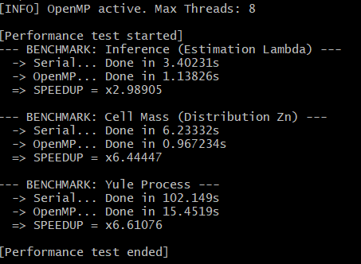
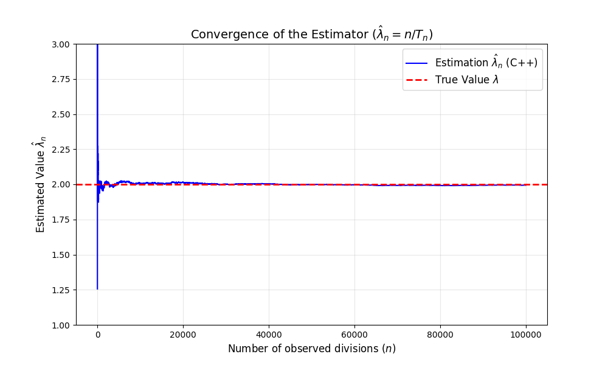
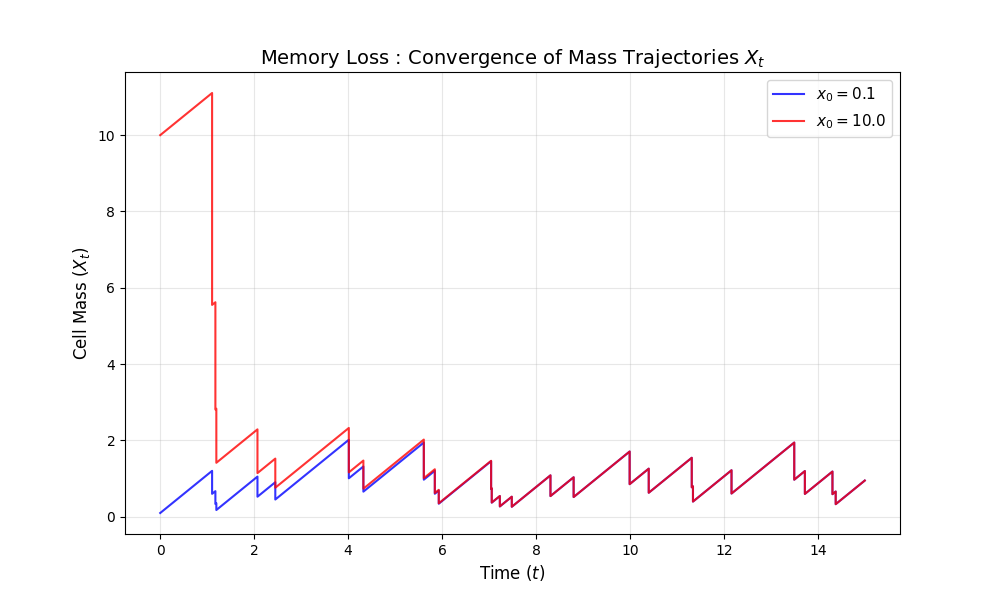
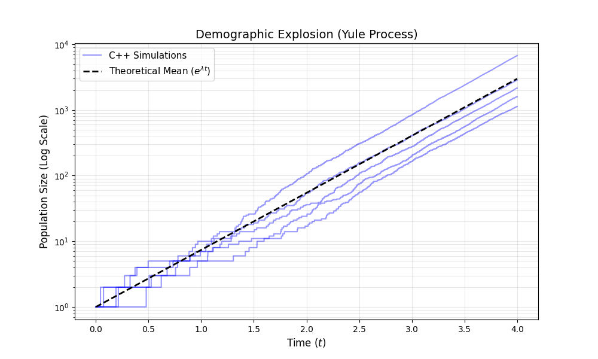

# Stochastic Dynamics of Cell Growth

## The Story & Academic Integrity

Basically this project started as a standard assignment for my **"Monte Carlo Methods & Markov Chains"** course (First Year of Applied Math Master). The job was to run numerical experiments to validate some probability theorems regarding cell division (CLT, Memory Loss, etc.).

I did the math, wrote the proofs, and generated the first plots in Python. You can find that serious academic part (Report & Slides) in the `docs/` folder, the code will not be published (maybe one day if I rewrite it in C++ or Julia, I'll see).

Python is great, but simulating millions of cells was taking several minutes. I wanted to use this playground to improve my skills in C++. So, I decided to re-engineer the core models from scratch, moving from a script-based approach to a proper compiled engine using **OpenMP** to burn all available CPU cores.

## The Benchmark

I pitted my naive implementation (Serial) against the optimized one (OpenMP). The goal was to simulate **50 million cells** and see if the optimization was worth the headache.

Here are the results on my 8-thread machine:

| Model | Load | Serial Time | OpenMP Time | Speedup |
| --- | --- | --- | --- | --- |
| **Inference**  | 50M samples | 3.40s | **1.13s** | **x2.98** |
| **Cell Mass** | 50M cells | 6.23s | **0.96s** | **x6.44** |
| **Yule Process** | 100k colonies | 102.15s | **15.45s** | **x6.61** |

Going from **1m 40s** to **15s** on the Yule process changed everything for my testing workflow.


## What exactly are we simulating?

I focused on the three "heavy" models of the project.

### 1. Statistical Inference (The Guessing Game)

We observe a sequence of cell lifetimes and try to estimate the division rate  using a Maximum Likelihood Estimator.

* **The Goal :** Verify that with enough samples, our error follows the Central Limit Theorem
* **The Tech :** It's a massive array summation problem, perfect for parallel reduction




### 2. Cell Mass Dynamics (The "Memory Loss")

We simulate two cells : one starts microscopic, the other starts massive. We track their lineage to see if they "forget" their initial size.

* **The Finding :** They do. The trajectories converge exponentially fast to the same distribution
* **The Trap :** I found a sampling bias. If you look at a population at time , cells are on average 2x bigger than if you just look at them "at birth" 



### 3. Population Explosion (Yule Process)

This is the big one. A full colony simulation where every cell can divide.

* **The Method :** I couldn't just simulate cells one by one (memory overload). I used the **Gillespie Algorithm** to jump from one event to the next
* **The Result :** The population grows exponentially, but purely by chance, the size at time  follows a Geometric distribution


## Under the Hood

The project is a hybrid:

* **C++ (src/) :** Does the heavy lifting. Handles the Monte-Carlo loops, RNG states, and threading
* **Python (scripts/) :** Just here to pick up the CSVs and make the graphs look good
* **Docker :** Because I didn't want the "it works on my machine" issue

## How to Play

If you want to run the benchmarks yourself :

### Option A: The "It Just Works" Way (Docker)

I packed everything (Compiler, Python, Libs) in a container.

```bash
docker-compose up --build

```

*Check the `/data` folder afterwards, the PNGs will be there.*

### Option B: The Manual Way

You'll need CMake, a C++ compiler with OpenMP support, and Python.

```bash
# 1. Compile 
mkdir build && cd build
cmake -G "MinGW Makefiles" .. 
mingw32-make

# 2. Run the engine
./cell_sim.exe

# 3. Draw the pictures
# (Assuming you are in build/ folder)
python ../scripts/plot_mass.py
python ../scripts/plot_yule.py

```

## Resources

* **Original Report :** `docs/Report.pdf`
* **Slides :** `docs/Slides.pdf`

### References

1. **Jury de l’Agrégation Externe de Mathématiques**, *Épreuve de modélisation, option A : Probabilités et Statistiques (Sujet A1)*, Session 2019.
2. **R. Diel**, *Cours et Travaux Pratiques de Méthodes de Monte-Carlo et Chaînes de Markov*, Université Côte d’Azur, 2024-2025.
3. **A. Godichon-Baggioni**, *Statistique Inférentielle (L3)*, Sorbonne Université, basée sur le cours de A. Guyader, 2020-2021.
4. **Y. Laguel**, *Do’s and don’ts of mathematical writing*, Université Côte d’Azur, Janvier 2025.
5. **V. Deshors**, *Yule Process Simulation (Implémentation Python)*, GitHub Repository.
Available at : [https://github.com/VictorDeshors/Yule_Process](https://github.com/VictorDeshors/Yule_Process)

